<!-- ## Here's Yidi! -->

<!--  -->
<table>
  <tr>
    <td>
      
    </td>
    <td>
      <a href="">
      
      <!--  -->
      </a>
    </td>
  </tr>
  <!-- <tr>
    <td>
      
    </td>
    <td>
    
    </td>
  </tr> -->
</table>

<!--  -->

<!--  -->
